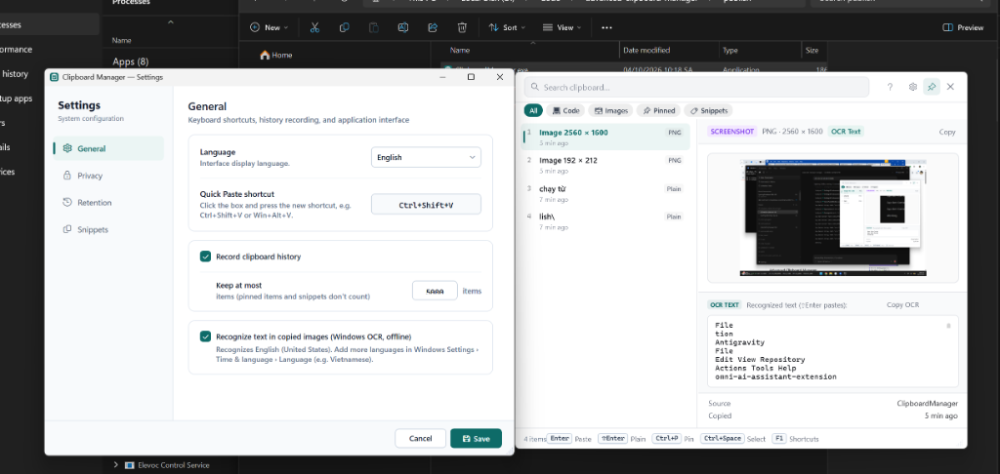

# Advanced Clipboard Manager

[English](README.md) • [Tiếng Việt](README.vi.md) • [简体中文](README.zh.md) • [日本語](README.ja.md) • [한국어](README.ko.md) • [Español](README.es.md) • [Français](README.fr.md) • [Deutsch](README.de.md) • [Русский](README.ru.md) • [Português](README.pt.md)

로컬 우선 (Local-first) 및 키보드 중심 (Keyboard-first)으로 설계된 Windows 10/11 및 macOS용 클립보드 관리 프로그램입니다. 클립보드 기록을 자동으로 저장하고 유형별로 분류하며, **Ctrl+Shift+V** (또는 macOS 메뉴 막대)로 원하는 항목을 즉시 검색하고 붙여넣을 수 있습니다.

> 상태: **단계 1–3 완료, 단계 4 (macOS) 진행 중** (로드맵 참조).

<p align="center">
  
</p>

## 주요 기능

| 기능 | 설명 |
|---|---|
| 클립보드 기록 | 복사된 모든 항목을 최신순으로 자동 저장합니다. 텍스트, 서식, 이미지 및 파일을 지원하며 중복 복사는 횟수 카운트와 함께 하나로 병합됩니다. |
| 빠른 붙여넣기 (Quick Paste) | **Ctrl+Shift+V**로 검색 팔레트를 엽니다. 방향키로 이동하고 **Enter**를 누르면 직전에 사용하던 앱에 즉시 붙여넣습니다. |
| 자동 콘텐츠 분류 | 로컬 규칙 엔진을 통해 SQL, JSON, XML, YAML, 셸, 소스 코드, 로그, URL (GitHub 등), 이메일, 전화번호, 숫자, IP 주소 및 Markdown을 자동 감지합니다. |
| 지능형 미리보기 | 콘텐츠에 따라 화면이 동적으로 조정됩니다: SQL/JSON/코드 구문 강조, 해상도 표시 (`PNG · 1103 × 593`) 및 오프라인 OCR 텍스트 추출, URL 세부정보 카드, 민감 데이터 마스킹 및 **Ctrl+R** 잠금 해제. |
| 스마트 검색 | SQLite FTS5 접두사 검색, 베트남어 무성조 검색 지원, 필터 기능: `type:sql`, `type:snippet`, `type:image`, `pinned:true`, `sensitive:true` 등. |
| 서식 유지 | HTML/RTF 스타일을 그대로 유지하여 **Enter**로 서식 붙여넣기 지원. **Ctrl+Shift+Enter**를 누르면 일반 텍스트(이미지의 경우 OCR 텍스트)로 붙여넣습니다. |
| 번호 빠른 붙여넣기 | 상위 9개 항목에 번호가 매겨져 **Ctrl+1…9**로 즉시 붙여넣을 수 있습니다 (`Shift` 조합 시 일반 텍스트). |
| 텍스트 변환 (Transforms) | **Ctrl+K** (또는 마우스 우클릭)로 대/소문자 변환, 공백 제거, 줄 결합, JSON 정렬/압축, SQL 포맷팅, Base64 및 URL 인코딩/디코딩 후 붙여넣기. |
| 연속 붙여넣기 스택 (Paste stack) | **Ctrl+Space**로 원하는 순서대로 항목을 선택한 후 **Ctrl+S**로 시작합니다. 아무 앱에서나 **Ctrl+V**를 누를 때마다 다음 항목이 순서대로 붙여넣어집니다 (양식 입력에 매우 유용). |
| 스니펫 및 템플릿 (Snippets) | 만료되지 않는 자주 쓰는 문구 저장: **Ctrl+N**으로 새 스니펫 등록, **Ctrl+E**로 편집. 동적 변수 지원: `{date}`, `{time}`, `{datetime}`, `{date:yyyy-MM-dd}`, `{clipboard}`, `{uuid}`. |
| 오프라인 OCR 이미지 텍스트 인식 | 복사된 이미지는 Windows 내장 오프라인 OCR을 통해 글자가 자동으로 추출되어 이미지 내용 검색 및 텍스트 붙여넣기가 가능합니다. |
| 화면 가장자리 고정 (Sidebar) | **Ctrl+D**로 화면 좌/우측에 팔레트를 도킹 고정합니다 (AppBar 모드, 작업 표시줄처럼 작업 공간 점유). |
| 로컬 데이터 암호화 | Windows DPAPI 계정 기반 암호화 지원 (비밀번호 불필요). 텍스트, 이미지 및 OCR 데이터가 디스크에 안전하게 암호화됩니다. |
| 즐겨찾기 고정 (Pin) | **Ctrl+P**로 상단 고정. 고정된 항목은 자동 만료되지 않으며 항상 목록 최상단에 유지됩니다. |
| 자동 만료 관리 | 종류별 보관 기간 설정: 민감 정보 5분, 비밀번호 1분, 텍스트 1일, 코드/URL 7일, 이미지 1시간 (설정에서 변경 가능). |
| 완벽한 개인정보 보호 | 모든 데이터는 로컬 `%LOCALAPPDATA%\ClipboardManager` (Windows) 또는 `~/Library/Application Support/ClipboardManager` (macOS)에만 저장되며 외부 인터넷 통신이 전혀 없습니다. |

### 단축키 안내

| 단축키 | 동작 |
|---|---|
| `↑` `↓` `PgUp` `PgDn` | 목록 탐색 |
| `Enter` | 붙여넣기 (다중 선택 시 병합 붙여넣기) |
| `Ctrl+Shift+Enter` | 서식 없는 일반 텍스트로 붙여넣기 |
| `Ctrl+1` … `Ctrl+9` | 1~9번 항목 즉시 붙여넣기 (`Shift` 추가 시 일반 텍스트) |
| `Ctrl+K` / 마우스 우클릭 | 텍스트 변환 메뉴 호출 후 붙여넣기 |
| `Ctrl+C` | 붙여넣지 않고 클립보드에만 복사 |
| `Ctrl+P` | 고정 / 고정 해제 |
| `Ctrl+Space` | 다중 선택 (선택 순서 보존) |
| `Ctrl+S` | 선택된 항목들로 연속 붙여넣기 스택 시작 |
| `Ctrl+N` / `Ctrl+E` | 스니펫으로 저장 / 선택된 스니펫 수정 |
| `Ctrl+R` | 마스킹된 민감 정보 표시 |
| `Ctrl+T` | 창 고정 / 항상 위에 표시 |
| `Ctrl+D` | 사이드바 도킹 전환: 오른쪽 → 왼쪽 → 끄기 |
| `Ctrl+L` | 분할 비율 변경: 25/75, 30/70, 40/60, 50/50 |
| `Ctrl+M` | 미니 위젯 모드 / 전체 창 모드 전환 |
| `Ctrl+Shift+T` | 아크릴 반투명 효과 켜기/끄기 |
| `Ctrl+,` | 환경설정 창 열기 |
| `F1` | 전체 단축키 안내 창 표시 |
| `Del` | 선택 항목 삭제 (검색어 끝에 커서가 있을 때) |
| `Esc` | 창 닫기 |

## 빌드 및 실행 (Windows)

요구 사항: Windows 10/11 x64 및 [.NET 8 SDK](https://dotnet.microsoft.com/download/dotnet/8.0) (`winget install Microsoft.DotNet.SDK.8`).

```powershell
.\build.ps1            # 빌드 + 단위 테스트 실행
.\build.ps1 -Run       # 빌드 및 실행 (Ctrl+Shift+V)
.\build.ps1 -Publish   # .\publish\ 폴더에 단일 실행 파일 (.exe) 생성
.\build.ps1 -Installer # .\dist\ 폴더에 Setup.exe 설치 프로그램 생성
.\build.ps1 -Msix      # .\dist\ 폴더에 Microsoft Store 패키지 (.msix) 생성
```

## 라이선스

[MIT](LICENSE) © [duytiena2](https://github.com/duytiena2)
